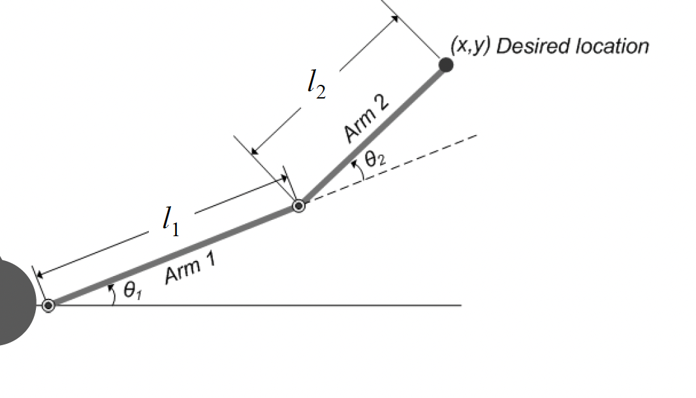

# Kinematics

This repository consists of 2 simulink files `Forward_Kinematics.slx` and `Inverse_kinematics.slx` . And finally there is the third file where the two individual models are packaged into a subsystem and then combined to be modeled as a single subsystem. 

The respective kinematic equations for the 2D arm forward kinematics and the inverse kinematics are based on the following equations. 

$$
\textnormal{Forward kinematics equations:}
~~~~~~~
\begin{aligned}
x &= l_1 \cos\theta_1 + l_2 \cos(\theta_1 + \theta_2) \\
y &= l_1 \sin\theta_1 + l_2 \sin(\theta_1 + \theta_2)
\end{aligned}
$$

$$
\textnormal{Inverse kinematics equations:}~~~~~~~
\begin{aligned}
\theta_1 &= \operatorname{atan2}(\dot{y}, \dot{x})  \\
\theta_2 &= \cos^{-1}\left(\frac{x^2 + y^2 - l_1^2 - l_2^2}{2 l_1 l_2}\right)
\end{aligned}
$$

$$
\dot{y}=y(d_{1}+d_2\cos\theta_2))-x(d_2\sin\theta_2)\\
\dot{x}=x(d_1+d_2\cos\theta_2)+y(d_2\sin\theta_2)
$$